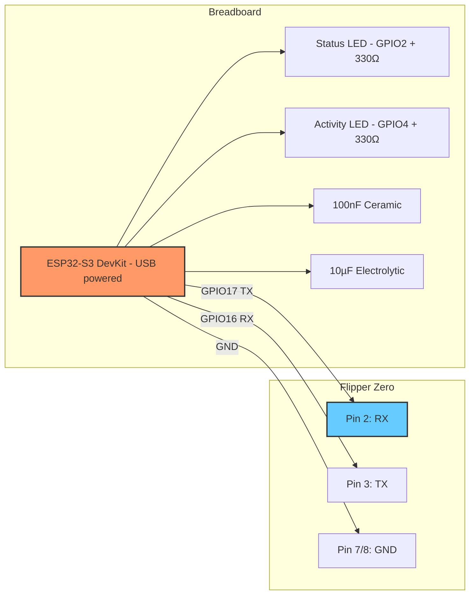
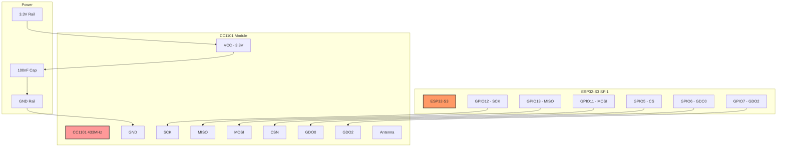
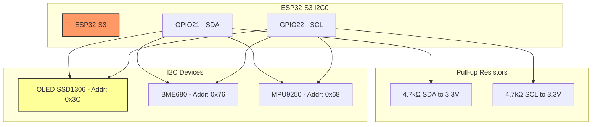
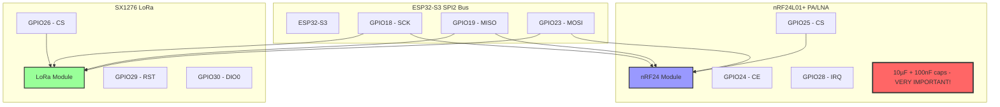

# Breadboard Prototype Guide

Complete guide to building a functional prototype on breadboards before designing the PCB.

---

## Prototyping Strategy

We'll build the board in **progressive phases**, testing each component before adding the next. This approach:
- ✅ Validates hardware design early
- ✅ Tests firmware on real hardware
- ✅ Identifies issues before PCB fabrication
- ✅ Costs ~$80-120 vs $185+ for full board

---

## Phase Overview

```
Phase 1: Core (ESP32-S3 + Flipper)          → 1-2 hours
Phase 2: Sub-GHz (Single CC1101)            → 2-3 hours
Phase 3: Display & Sensors                   → 1-2 hours
Phase 4: Advanced RF (nRF24, LoRa)          → 2-3 hours
Phase 5: Multi-MCU (ESP32-C6 or RP2040)     → 3-4 hours
Phase 6: Complete Integration                → 4-6 hours
```

---

## Phase 1: Core System (Minimum Viable Prototype)

### Goal
ESP32-S3 communicating with Flipper Zero via UART.

### Breadboard Layout - Phase 1

```
Breadboard 1 (830 tie-points recommended)
═══════════════════════════════════════════════════════════════

Power Rails:
  [+] ────────────────── 3.3V (from ESP32-S3 DevKit)
  [-] ────────────────── GND

     A  B  C  D  E     F  G  H  I  J
   ┌─────────────────────────────────┐
 1 │                                 │  Power input from USB
 2 │                                 │
 3 │        [ESP32-S3 DevKit]        │  Rows 5-35
 4 │                                 │
...│         (40 pins)               │
35 │                                 │
   │                                 │
40 │  [Status LED + 330Ω]            │  GPIO2 → LED → GND
41 │                                 │
42 │  [Activity LED + 330Ω]          │  GPIO4 → LED → GND
43 │                                 │
44 │  [100nF capacitor]              │  3.3V → GND (decoupling)
45 │  [10µF capacitor]               │  3.3V → GND (bulk)
   │                                 │
50 │  Jumper wires to Flipper:       │
51 │    GPIO17 → Flipper RX          │
52 │    GPIO16 → Flipper TX          │
53 │    GND → Flipper GND            │
   └─────────────────────────────────┘
```

### Wiring - Phase 1



### Parts - Phase 1
- 1x ESP32-S3 DevKit (with USB-C)
- 1x Large breadboard (830 tie-points)
- 2x LEDs (any color)
- 2x 330Ω resistors
- 1x 100nF ceramic capacitor
- 1x 10µF electrolytic capacitor
- 10x Jumper wires (male-to-male)
- 5x Jumper wires (male-to-female, for Flipper)
- 1x Flipper Zero

### Testing - Phase 1
1. Flash firmware to ESP32-S3
2. Connect to Flipper Zero
3. Send ping command from Flipper
4. Verify pong response
5. LEDs should blink on activity

**Success Criteria**: UART communication working, LEDs responding

---

## Phase 2: Sub-GHz RF (Single CC1101)

### Goal
Add one CC1101 module for 433MHz testing.

### Breadboard Layout - Phase 2

```
Breadboard 1 - Expanded
═══════════════════════════════════════════════════════════════

     A  B  C  D  E     F  G  H  I  J
   ┌─────────────────────────────────┐
...│  [ESP32-S3 from Phase 1]        │  Rows 5-35
   │                                 │
60 │  [CC1101 Module]                │  Rows 60-70
61 │    VCC → 3.3V                   │
62 │    GND → GND                    │
63 │    SCK → GPIO12                 │
64 │    MISO → GPIO13                │
65 │    MOSI → GPIO11                │
66 │    CS → GPIO5                   │
67 │    GDO0 → GPIO6                 │
68 │    GDO2 → GPIO7                 │
69 │    [100nF cap] VCC→GND          │
70 │                                 │
71 │  [433MHz Antenna]               │  Soldered or U.FL
   └─────────────────────────────────┘
```

### Wiring - Phase 2



### Parts Added - Phase 2
- 1x CC1101 module (433MHz or 315/868/915MHz)
- 1x 433MHz antenna (spring antenna or wire)
- 1x 100nF ceramic capacitor
- 8x Additional jumper wires

### Testing - Phase 2
1. Initialize SPI bus
2. Read CC1101 chip version (should be 0x14)
3. Configure for 433MHz ASK modulation
4. Transmit test pattern
5. Receive test pattern (use 2 boards or SDR)

**Success Criteria**: CC1101 responding, able to TX/RX at 433MHz

---

## Phase 3: Display & Sensors

### Goal
Add OLED display and I2C sensors.

### Breadboard Layout - Phase 3

```
Breadboard 2 (New - 830 tie-points)
═══════════════════════════════════════════════════════════════

I2C Bus with Pull-ups:
  SDA: GPIO21 ──[4.7kΩ]── 3.3V
  SCL: GPIO22 ──[4.7kΩ]── 3.3V

     A  B  C  D  E     F  G  H  I  J
   ┌─────────────────────────────────┐
 5 │  [4.7kΩ Pull-up Resistors]      │
 6 │    SDA to 3.3V                  │
 7 │    SCL to 3.3V                  │
 8 │                                 │
10 │  [OLED Display 128x64]          │  Rows 10-18
11 │    VCC → 3.3V                   │
12 │    GND → GND                    │
13 │    SDA → GPIO21 (via pull-up)   │
14 │    SCL → GPIO22 (via pull-up)   │
15 │    [100nF cap] VCC→GND          │
   │                                 │
20 │  [BME680 Sensor]                │  Rows 20-26
21 │    VCC → 3.3V                   │
22 │    GND → GND                    │
23 │    SDA → GPIO21 (shared)        │
24 │    SCL → GPIO22 (shared)        │
25 │    [100nF cap] VCC→GND          │
   │                                 │
30 │  [MPU9250 IMU]                  │  Rows 30-36
31 │    VCC → 3.3V                   │
32 │    GND → GND                    │
33 │    SDA → GPIO21 (shared)        │
34 │    SCL → GPIO22 (shared)        │
35 │    [100nF cap] VCC→GND          │
   └─────────────────────────────────┘
```

### Wiring - Phase 3



### Parts Added - Phase 3
- 1x Second breadboard (830 tie-points)
- 1x OLED display 0.96" I2C (SSD1306)
- 1x BME680 sensor module
- 1x MPU9250 9-DOF IMU module
- 2x 4.7kΩ resistors (I2C pull-ups)
- 3x 100nF ceramic capacitors
- 15x Jumper wires

### Testing - Phase 3
1. Scan I2C bus (should find 0x3C, 0x76, 0x68)
2. Display "Hello World" on OLED
3. Read temperature from BME680
4. Read accelerometer from MPU9250
5. Display sensor data on OLED

**Success Criteria**: All I2C devices responding, OLED showing data

---

## Phase 4: Advanced RF (nRF24 & LoRa)

### Goal
Add 2.4GHz and LoRa capabilities.

### Breadboard Layout - Phase 4

```
Breadboard 1 - Further Expanded
═══════════════════════════════════════════════════════════════

     A  B  C  D  E     F  G  H  I  J
   ┌─────────────────────────────────┐
...│  [Previous components]           │
   │                                 │
75 │  [nRF24L01+ Module with PA/LNA] │  Rows 75-85
76 │    VCC → 3.3V (via cap!)        │  Note: Needs clean power
77 │    GND → GND                    │
78 │    SCK → GPIO18 (SPI2)          │
79 │    MISO → GPIO19                │
80 │    MOSI → GPIO23                │
81 │    CS → GPIO25                  │
82 │    CE → GPIO24                  │
83 │    IRQ → GPIO28                 │
84 │    [10µF cap] VCC→GND           │  Important for PA!
85 │    [100nF cap] VCC→GND          │
86 │    [2.4GHz Antenna]             │
   │                                 │
90 │  [SX1276 LoRa Module]           │  Rows 90-100
91 │    VCC → 3.3V                   │
92 │    GND → GND                    │
93 │    SCK → GPIO18 (SPI2 shared)   │
94 │    MISO → GPIO19                │
95 │    MOSI → GPIO23                │
96 │    CS → GPIO26                  │
97 │    RST → GPIO29                 │
98 │    DIO0 → GPIO30                │
99 │    [100nF cap] VCC→GND          │
100│    [868/915MHz Antenna]         │
   └─────────────────────────────────┘
```

### Wiring - Phase 4



### Parts Added - Phase 4
- 1x nRF24L01+ module with PA/LNA
- 1x SX1276 LoRa module (868MHz or 915MHz)
- 1x 2.4GHz antenna for nRF24
- 1x LoRa antenna (868/915MHz)
- 2x 10µF electrolytic capacitors
- 2x 100nF ceramic capacitors
- 15x Jumper wires

### Testing - Phase 4
1. Initialize nRF24 (check chip presence)
2. Set nRF24 to TX mode, transmit packet
3. Initialize LoRa module
4. Send LoRa packet (use second board or gateway to receive)
5. Test range with external antennas

**Success Criteria**: Both modules responding, able to TX packets

---

## Phase 5: Multi-MCU (ESP32-C6 or RP2040)

Choose ONE to start:

### Option A: ESP32-C6 (WiFi 6 / Thread)

```
Breadboard 3 (New)
═══════════════════════════════════════════════════════════════

     A  B  C  D  E     F  G  H  I  J
   ┌─────────────────────────────────┐
 5 │  [ESP32-C6 DevKit]              │  Rows 5-30
...│    (USB powered)                │
   │                                 │
35 │  I2C Connection to ESP32-S3:    │
36 │    GPIO6 (SDA) → ESP32-S3 GPIO21│
37 │    GPIO7 (SCL) → ESP32-S3 GPIO22│
38 │    GND → Common GND             │
   │                                 │
40 │  IRQ Line:                      │
41 │    GPIO12 → ESP32-S3 GPIO40     │
   │                                 │
45 │  [Status LED + 330Ω]            │  GPIO2
   └─────────────────────────────────┘
```

### Option B: RP2040 (GPIO Expansion)

```
Breadboard 3 (New)
═══════════════════════════════════════════════════════════════

     A  B  C  D  E     F  G  H  I  J
   ┌─────────────────────────────────┐
 5 │  [Raspberry Pi Pico]            │  Rows 5-30
...│    (RP2040, USB powered)        │
   │                                 │
35 │  I2C Connection to ESP32-S3:    │
36 │    GP0 (SDA) → ESP32-S3 GPIO21  │
37 │    GP1 (SCL) → ESP32-S3 GPIO22  │
38 │    GND → Common GND             │
   │                                 │
40 │  IRQ Line:                      │
41 │    GP6 → ESP32-S3 GPIO41        │
   │                                 │
45 │  [40-pin header breakout]       │  Rows 45-65
...│    GP7-GP26 available           │
   └─────────────────────────────────┘
```

### Parts - Phase 5 (Choose One)

**Option A - ESP32-C6:**
- 1x ESP32-C6 DevKit
- 1x Breadboard
- 1x LED + 330Ω resistor
- 10x Jumper wires

**Option B - RP2040:**
- 1x Raspberry Pi Pico (RP2040)
- 1x Breadboard
- 1x 40-pin header (optional)
- 10x Jumper wires

### Testing - Phase 5
1. Flash secondary MCU firmware
2. Verify I2C slave mode (scan from ESP32-S3)
3. Send command from S3 to secondary
4. Receive response
5. Test IRQ line functionality

**Success Criteria**: Multi-MCU I2C communication working

---

## Complete Breadboard Setup

### Final Configuration (All Phases Combined)

```
╔══════════════════════════════════════════════════════════════╗
║                    COMPLETE PROTOTYPE                        ║
╠══════════════════════════════════════════════════════════════╣
║                                                              ║
║  BREADBOARD 1: ESP32-S3 + RF Modules                        ║
║  ┌────────────────────────────────────────────────┐         ║
║  │  - ESP32-S3 DevKit (main controller)           │         ║
║  │  - CC1101 433MHz (Sub-GHz)                     │         ║
║  │  - nRF24L01+ PA/LNA (2.4GHz)                   │         ║
║  │  - SX1276 LoRa (868/915MHz)                    │         ║
║  │  - Status LEDs                                 │         ║
║  │  - Power supply (USB + capacitors)             │         ║
║  └────────────────────────────────────────────────┘         ║
║                                                              ║
║  BREADBOARD 2: I2C Sensors & Display                        ║
║  ┌────────────────────────────────────────────────┐         ║
║  │  - OLED Display 128x64                         │         ║
║  │  - BME680 Environmental Sensor                 │         ║
║  │  - MPU9250 9-DOF IMU                           │         ║
║  │  - 4.7kΩ I2C pull-ups                          │         ║
║  │  - Decoupling capacitors                       │         ║
║  └────────────────────────────────────────────────┘         ║
║                                                              ║
║  BREADBOARD 3: Secondary MCU (Optional)                     ║
║  ┌────────────────────────────────────────────────┐         ║
║  │  - ESP32-C6 DevKit OR Raspberry Pi Pico        │         ║
║  │  - I2C connection to main board                │         ║
║  │  - GPIO expansion header                       │         ║
║  └────────────────────────────────────────────────┘         ║
║                                                              ║
║  CONNECTIONS TO FLIPPER ZERO:                               ║
║  ┌────────────────────────────────────────────────┐         ║
║  │  - UART: RX/TX/GND (3 wires)                   │         ║
║  │  - Optional: IRQ line                          │         ║
║  │  - Optional: Power from Flipper 3.3V           │         ║
║  └────────────────────────────────────────────────┘         ║
║                                                              ║
╚══════════════════════════════════════════════════════════════╝
```

---

## Power Requirements

### Power Budget for Breadboard Prototype

| Component | Idle | Active | Peak |
|-----------|------|--------|------|
| ESP32-S3 | 40mA | 160mA | 240mA |
| CC1101 | 1mA | 30mA | 60mA |
| nRF24 PA/LNA | 5mA | 50mA | 115mA |
| LoRa SX1276 | 2mA | 50mA | 120mA |
| OLED | 10mA | 15mA | 20mA |
| Sensors (BME680+IMU) | 5mA | 10mA | 15mA |
| ESP32-C6 (optional) | 40mA | 150mA | 180mA |
| **Total (without C6)** | **63mA** | **315mA** | **570mA** |
| **Total (with C6)** | **103mA** | **465mA** | **750mA** |

**Power Source Options:**
1. **USB from ESP32-S3 DevKit** - Up to 500mA (sufficient for most testing)
2. **External 3.3V supply** - Lab power supply, 1A recommended
3. **Flipper Zero 3.3V** - Up to ~300mA (only for minimal testing!)

⚠️ **Warning**: nRF24 with PA/LNA can draw significant current spikes. ALWAYS use decoupling caps!

---

## Common Issues & Troubleshooting

### Issue 1: ESP32 Won't Flash
**Symptoms**: Upload fails, connection timeout
**Solutions**:
- Hold BOOT button while connecting USB
- Press RESET after upload starts
- Check USB cable (must support data)
- Install CH340/CP2102 drivers

### Issue 2: No I2C Devices Found
**Symptoms**: I2C scan returns nothing
**Solutions**:
- Check 4.7kΩ pull-ups installed
- Verify SDA/SCL not swapped
- Ensure common ground
- Check device addresses (use i2cdetect)

### Issue 3: SPI Device Not Responding
**Symptoms**: Can't read chip ID
**Solutions**:
- Verify SPI bus not shared incorrectly
- Check MISO/MOSI not swapped
- Ensure CS pin goes LOW
- Add 100nF decoupling cap near module
- Check clock speed (try 1MHz first)

### Issue 4: nRF24 Unstable
**Symptoms**: Random resets, garbled data
**Solutions**:
- **Critical**: Add 10µF + 100nF caps at VCC
- Use short, thick wires for power
- Reduce SPI clock speed
- Ensure 3.3V is stable (measure with multimeter)

### Issue 5: UART Not Working with Flipper
**Symptoms**: No communication
**Solutions**:
- Verify TX/RX not swapped (TX→RX, RX→TX)
- Check baud rate (115200)
- Ensure common ground
- Test with USB-to-TTL adapter first

### Issue 6: OLED Display Blank
**Symptoms**: Display powers on but shows nothing
**Solutions**:
- Check I2C address (0x3C or 0x3D)
- Verify contrast setting in code
- Reset display (power cycle)
- Try display.begin() with address parameter

---

## Testing Checklist

### ✅ Phase 1 - Core
- [ ] ESP32-S3 powers on via USB
- [ ] Status LED blinks
- [ ] UART loopback test (TX→RX)
- [ ] Flipper receives ping/pong
- [ ] Serial monitor shows debug output

### ✅ Phase 2 - Sub-GHz
- [ ] CC1101 chip detected (version 0x14)
- [ ] SPI communication stable
- [ ] Can set frequency (433MHz)
- [ ] Transmit signal detected on SDR
- [ ] GDO0 interrupt works

### ✅ Phase 3 - Display
- [ ] I2C scan finds all devices
- [ ] OLED shows text
- [ ] BME680 reads temperature
- [ ] IMU reads acceleration
- [ ] Sensor data updates on display

### ✅ Phase 4 - Advanced RF
- [ ] nRF24 detected and stable
- [ ] LoRa module responds
- [ ] Can transmit on both
- [ ] Range test successful
- [ ] No power supply issues

### ✅ Phase 5 - Multi-MCU
- [ ] Secondary MCU detects on I2C
- [ ] Command/response works
- [ ] IRQ line triggers correctly
- [ ] Both MCUs stable together

---

## Next Steps After Breadboard

Once breadboard prototype is working:

1. **Document Issues** - Note any problems encountered
2. **Test All Features** - Verify every function works
3. **Measure Power** - Actual current draw vs. estimates
4. **Design PCB** - Transfer breadboard design to KiCad
5. **Order PCB** - First revision prototype
6. **Assemble & Test** - Compare PCB vs breadboard performance
7. **Iterate** - Fix any PCB issues in revision 2

---

## Safety Tips

⚠️ **Important Safety Guidelines:**

1. **Never exceed 3.3V** on ESP32 GPIO pins
2. **Always use decoupling capacitors** - 100nF minimum per IC
3. **Watch for shorts** - Double-check wiring before power-on
4. **Current limits** - Don't exceed USB port rating (500mA)
5. **ESD protection** - Touch grounded metal before handling boards
6. **RF safety** - Don't transmit without antenna (damages PA)
7. **Polarity** - Check electrolytic capacitor polarity (+ and -)
8. **Heat** - Some components may get warm (normal if <60°C)

---

**You're ready to start prototyping!** Begin with Phase 1 and progressively build up to the complete system. 🚀
