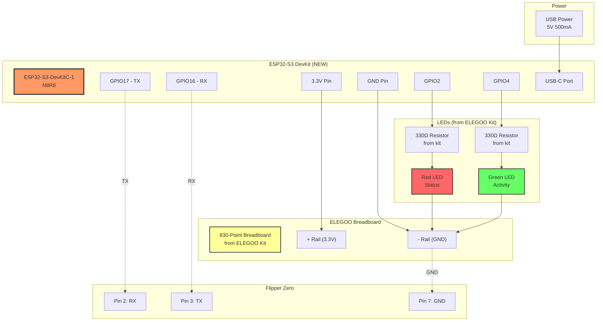
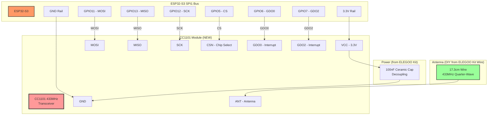
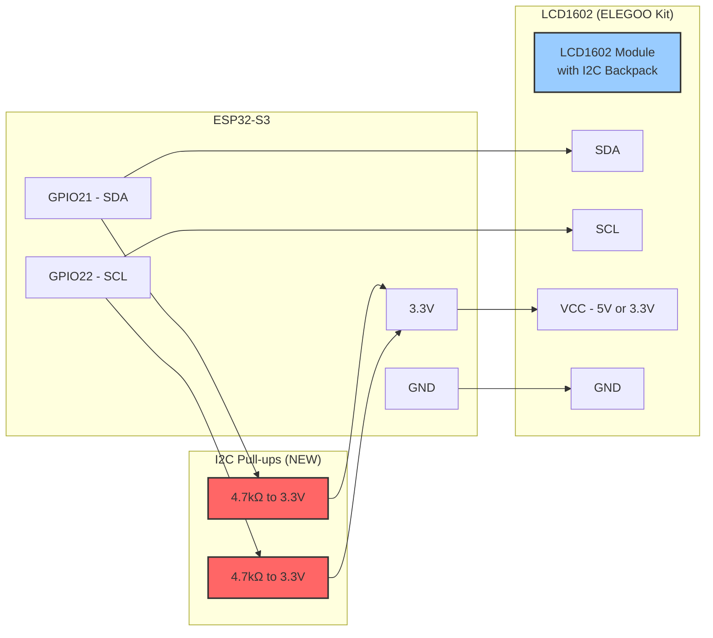
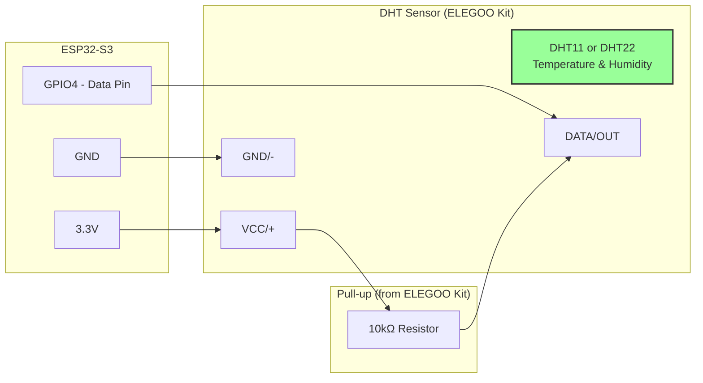
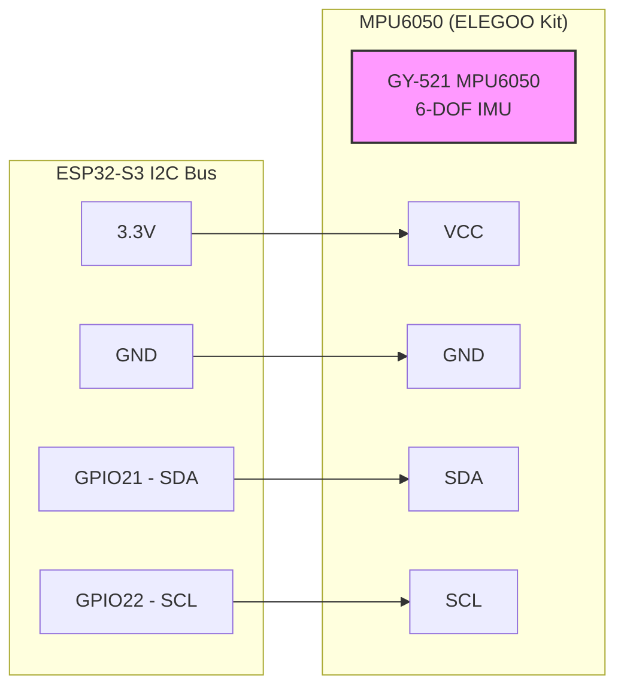

# ESP32-S3 + ELEGOO Kit - Complete Wiring Guide

Step-by-step wiring diagrams showing how to build the Flipper Zero dev board using your ELEGOO Mega 2560 Complete Starter Kit components.

---

## 🎯 Project Overview

**What You're Building**:
```
ESP32-S3 DevKit (new purchase: £12-15)
    +
ELEGOO Mega Kit Components (you already have!)
    +
CC1101 RF Module (new purchase: £6-8)
    ↓
= Ultimate Flipper Zero Dev Board
```

**Total Cost**: £19-25 (vs £67-89 buying everything new!)

---

## Phase 1: Basic Setup (ESP32-S3 + ELEGOO Kit)

### Parts Needed

**From ELEGOO Kit** ✓:
- 1x 830-point breadboard
- 10x Male-to-male jumper wires
- 5x Female-to-male DuPont wires
- 2x Red LEDs
- 2x Green LEDs
- 2x 330Ω resistors
- USB cable (for ESP32)

**New Purchase** 🛒:
- 1x ESP32-S3 DevKit (N8R8)

---

### Breadboard Layout - Phase 1

```
═══════════════════════════════════════════════════════════════════════════
ELEGOO 830-Point Breadboard Layout
═══════════════════════════════════════════════════════════════════════════

Power Rails (both sides):
  [+]  ─────────────────────────  3.3V from ESP32-S3
  [-]  ─────────────────────────  GND from ESP32-S3

     A    B    C    D    E        F    G    H    I    J
   ┌───────────────────────────────────────────────────┐
 1 │                                                    │ Power Section
 2 │  [+] ────────────────────────────────────── [+]   │
 3 │  [-] ────────────────────────────────────── [-]   │
 4 │                                                    │
 5 │              ┌─────────────────┐                  │
 6 │              │                 │                  │ ESP32-S3 DevKit
 7 │              │   ESP32-S3      │                  │ (straddling center)
...│              │   DevKit        │                  │ Pins 1-20 on left
25 │              │   (40 pins)     │                  │ Pins 21-40 on right
26 │              │                 │                  │
27 │              └─────────────────┘                  │
28 │                                                    │
30 │  Status LED Section:                              │
31 │  [Red LED] ──[330Ω]── GPIO2                       │ Status
32 │     └─ GND                                        │
33 │                                                    │
34 │  [Green LED] ──[330Ω]── GPIO4                     │ Activity
35 │     └─ GND                                        │
36 │                                                    │
40 │  Flipper Zero Connection:                         │
41 │  F-to-M wire: GPIO17 → Flipper Pin 2 (RX)        │
42 │  F-to-M wire: GPIO16 → Flipper Pin 3 (TX)        │
43 │  F-to-M wire: GND → Flipper Pin 7 (GND)          │
44 │                                                    │
45 │  Power Decoupling (near ESP32):                   │
46 │  [Cap spot - will add later]                      │
   └───────────────────────────────────────────────────┘
```

---

### Detailed Wiring Diagram - Phase 1



---

### Step-by-Step Assembly - Phase 1

#### Step 1: Prepare Breadboard (5 min)

1. **Get your ELEGOO breadboard** from the kit
2. **Clean the surface** - remove any dust
3. **Check power rails** - should have red/blue lines

#### Step 2: Insert ESP32-S3 (5 min)

1. **Orient ESP32-S3** with USB port facing you
2. **Straddle the center gap** of breadboard
3. **Insert carefully** - Rows 5-27 (example positioning)
4. **Press firmly** - all pins should be in tie-points

**Critical**: Don't bend pins! Insert straight down.

```
Side View:
  Left Side Pins (A-E)    Center Gap    Right Side Pins (F-J)
       ||||                  ||                ||||
    ───────────────────────────────────────────────
    A  B  C  D  E    Gap    F  G  H  I  J
```

#### Step 3: Connect Power Rails (5 min)

1. **Find 3.3V pin** on ESP32-S3 (check pinout)
2. **Run wire** from 3.3V to **red [+] rail** (both sides)
3. **Find GND pin** on ESP32-S3
4. **Run wire** from GND to **blue [-] rail** (both sides)

**Use**: M-M jumpers from ELEGOO kit

```
ESP32-S3 Pin    →  Breadboard Rail
━━━━━━━━━━━━━━━━━━━━━━━━━━━━━━━━━
3.3V           →  [+] red rail
GND            →  [-] blue rail
```

#### Step 4: Add Status LEDs (10 min)

**LED 1 - Red (Status)**:
1. **Get red LED** from ELEGOO kit
2. **Get 330Ω resistor** (orange-orange-brown bands)
3. **Insert LED** in breadboard:
   - **Long leg (+)** → Row 31, Column C
   - **Short leg (-)** → Row 31, Column D
4. **Insert resistor**:
   - One leg → Row 31, Column B
   - Other leg → Row 31, Column A
5. **Wire GPIO2** → Row 31, Column A (same row as resistor)
6. **Wire Row 31, Column D** → [-] GND rail

```
Circuit:
ESP32 GPIO2 ──[330Ω]──┬──[LED]──┬── GND
                       │         │
                    Anode(+)  Cathode(-)
```

**LED 2 - Green (Activity)**:
Repeat for GPIO4, Row 34

#### Step 5: Connect to Flipper Zero (10 min)

**Get 3x female-to-male DuPont wires** from ELEGOO kit:

1. **TX Connection**:
   - Female end → Flipper Zero Pin 2 (RX)
   - Male end → ESP32-S3 GPIO17

2. **RX Connection**:
   - Female end → Flipper Zero Pin 3 (TX)
   - Male end → ESP32-S3 GPIO16

3. **Ground**:
   - Female end → Flipper Zero Pin 7 or 8 (GND)
   - Male end → Breadboard [-] GND rail

**CRITICAL**: TX goes to RX, RX goes to TX (crossover!)

```
Flipper GPIO Header (viewed from front):
┌────┬────┬────┬────┬────┬────┬────┬────┐
│ 1  │ 2  │ 3  │ 4  │ 5  │ 6  │ 7  │ 8  │
│3.3V│ RX │ TX │GPIO│GPIO│GPIO│GND │GND │
└────┴────┴────┴────┴────┴────┴────┴────┘
       ↑    ↑                   ↑
       │    │                   └── GND wire
       │    └────────────────────── GPIO16 (ESP32 RX)
       └─────────────────────────── GPIO17 (ESP32 TX)
```

#### Step 6: Power Up & Test (5 min)

1. **Connect USB cable** to ESP32-S3
2. **Plug into computer**
3. **Check**:
   - Power LED on ESP32 should light
   - Both your LEDs should be OFF (no code yet)
4. **Verify**:
   - Measure 3.3V between [+] and [-] rails with multimeter
   - Check for no shorts

**Expected**: ESP32 powered, no smoke, ready to program!

---

### Phase 1 Complete Schematic

```
                                ELEGOO BREADBOARD
    ╔════════════════════════════════════════════════════════════╗
    ║                                                            ║
    ║   [+] ══════════════════════════════════════════════ [+]  ║
    ║   [-] ══════════════════════════════════════════════ [-]  ║
    ║                                                            ║
    ║        ┌─────────────────────────────────────┐            ║
    ║        │        ESP32-S3 DevKit               │            ║
    ║        │  ┌──────────────────────────────┐   │            ║
    ║        │  │                              │   │            ║
    ║        │  │  3.3V ────────────────────┼──┼───┼──→ [+]     ║
    ║        │  │  GND  ────────────────────┼──┼───┼──→ [-]     ║
    ║        │  │  GPIO2 ───────────────────┼──┼───┼──┐         ║
    ║        │  │  GPIO4 ───────────────────┼──┼───┼──┼─┐       ║
    ║        │  │  GPIO16 (RX) ─────────────┼──┼───┼──┼─┼─┐     ║
    ║        │  │  GPIO17 (TX) ─────────────┼──┼───┼──┼─┼─┼─┐   ║
    ║        │  │                              │   │  │ │ │ │   ║
    ║        │  │  USB-C ◄─── USB Power       │   │  │ │ │ │   ║
    ║        │  └──────────────────────────────┘   │  │ │ │ │   ║
    ║        └─────────────────────────────────────┘  │ │ │ │   ║
    ║                                                  │ │ │ │   ║
    ║         [330Ω] ─── [Red LED] ──────────────┐ ◄──┘ │ │ │   ║
    ║                              │                     │ │ │   ║
    ║         [330Ω] ─── [Green LED] ────────────┼─── ◄──┘ │ │   ║
    ║                              │              │         │ │   ║
    ║                              └──────────────┴────→ [-]│ │   ║
    ║                                                        │ │   ║
    ╚════════════════════════════════════════════════════════╪═╪═══╝
                                                             │ │
                        ┌────────────────────────────────────┘ │
                        │  ┌───────────────────────────────────┘
                        ▼  ▼
                    ┌────────────┐
                    │  Flipper   │
                    │   Zero     │
                    │            │
                    │ Pin 2: RX ◄┼──── GPIO17 (TX)
                    │ Pin 3: TX ─┼───→ GPIO16 (RX)
                    │ Pin 7: GND─┼───→ GND
                    └────────────┘
```

---

## Phase 2: Add CC1101 Sub-GHz Module

### Additional Parts Needed

**From ELEGOO Kit** ✓:
- 8x M-M jumper wires
- 1x 17.3cm solid wire (for antenna)
- Wire strippers (to make antenna)

**New Purchase** 🛒:
- 1x CC1101 433MHz module

**Optional but Recommended** 🛒:
- 1x 100nF ceramic capacitor (£0.20)

---

### Breadboard Layout - Phase 2

```
═══════════════════════════════════════════════════════════════════════════
ELEGOO Breadboard - Adding CC1101
═══════════════════════════════════════════════════════════════════════════

     A    B    C    D    E        F    G    H    I    J
   ┌───────────────────────────────────────────────────┐
...│  [ESP32-S3 from Phase 1]                          │
   │                                                    │
50 │  CC1101 Module Section:                           │
51 │  ┌──────────────┐                                 │
52 │  │  CC1101      │    Pin Layout:                  │
53 │  │  433MHz      │    ┌─────────┐                  │
54 │  │              │    │ VCC GDO0│                  │
55 │  │  [Antenna]   │    │ GND  CSN│                  │
56 │  └──────────────┘    │MOSI  SCK│                  │
57 │                      │MISO GDO2│                  │
58 │  Connections:        └─────────┘                  │
59 │  VCC  → [+] 3.3V                                  │
60 │  GND  → [-] GND                                   │
61 │  MOSI → GPIO11 (ESP32-S3)                         │
62 │  MISO → GPIO13                                    │
63 │  SCK  → GPIO12                                    │
64 │  CSN  → GPIO5                                     │
65 │  GDO0 → GPIO6                                     │
66 │  GDO2 → GPIO7                                     │
67 │                                                    │
68 │  [100nF cap] VCC ↔ GND (near CC1101)             │
   └───────────────────────────────────────────────────┘
```

---

### Wiring Diagram - CC1101 to ESP32-S3



---

### Step-by-Step Assembly - Phase 2

#### Step 1: Prepare CC1101 Module (10 min)

1. **Inspect CC1101 module**
   - Check for "CC1101" marking
   - Count 8 pins

2. **Solder header pins** (if not pre-soldered):
   - Insert 8-pin male header into breadboard
   - Place CC1101 on top
   - Solder from component side
   - Remove from breadboard when cool

3. **Identify pins** (check your module's silkscreen):
   ```
   Top view of CC1101:
   ┌──────────┐
   │ VCC GDO0 │
   │ GND  CSN │
   │MOSI  SCK │
   │MISO GDO2 │
   └──────────┘
   ```

#### Step 2: Make DIY Antenna (5 min)

**Using wire from ELEGOO kit**:

1. **Get solid core wire** from kit
2. **Measure 17.3cm** (for 433MHz quarter-wave)
3. **Strip 1cm** from one end
4. **Coil the rest** loosely for storage

**Frequency Chart**:
| Frequency | Wire Length |
|-----------|-------------|
| 315 MHz   | 23.8 cm     |
| 433 MHz   | 17.3 cm     |
| 868 MHz   | 8.2 cm      |
| 915 MHz   | 7.8 cm      |

**Or**: Buy helical antenna for £2-3

#### Step 3: Insert CC1101 into Breadboard (5 min)

1. **Position**: Rows 51-58 (example)
2. **Orient**: Pin 1 (VCC) towards left
3. **Insert gently**: All 8 pins in tie-points
4. **Press firmly**: Ensure good contact

```
Breadboard insertion:
    A   B   C   D   E       (Rows 51-58)
    │   │   │   │   │
    VCC GND MOSI MISO ← Left side (example)

        F   G   H   I   J
        │   │   │   │   │
        GDO0 CSN SCK GDO2 ← Right side
```

#### Step 4: Wire Power (5 min)

**Use M-M jumpers from ELEGOO kit**:

1. **VCC connection**:
   - One end → CC1101 VCC pin
   - Other end → [+] 3.3V rail

2. **GND connection**:
   - One end → CC1101 GND pin
   - Other end → [-] GND rail

3. **Add decoupling cap** (if you have one):
   - 100nF between VCC and GND (close to module)

**CRITICAL**: CC1101 is 3.3V ONLY! Never connect to 5V!

#### Step 5: Wire SPI Bus (15 min)

**Use different colored wires** from ELEGOO kit to keep track:

```
CC1101 Pin  →  ESP32-S3 Pin   Wire Color (example)
━━━━━━━━━━━━━━━━━━━━━━━━━━━━━━━━━━━━━━━━━━━━━━━━━━━
MOSI       →  GPIO11          Orange
MISO       →  GPIO13          Yellow
SCK        →  GPIO12          White
CSN        →  GPIO5           Green
GDO0       →  GPIO6           Blue
GDO2       →  GPIO7           Purple
```

**Wiring steps**:

1. **MOSI (Master Out, Slave In)**:
   - CC1101 MOSI pin → ESP32-S3 GPIO11

2. **MISO (Master In, Slave Out)**:
   - CC1101 MISO pin → ESP32-S3 GPIO13

3. **SCK (Clock)**:
   - CC1101 SCK pin → ESP32-S3 GPIO12

4. **CSN (Chip Select)**:
   - CC1101 CSN pin → ESP32-S3 GPIO5

5. **GDO0 (Interrupt/Data Out)**:
   - CC1101 GDO0 pin → ESP32-S3 GPIO6

6. **GDO2 (Interrupt/Data Out)**:
   - CC1101 GDO2 pin → ESP32-S3 GPIO7

#### Step 6: Attach Antenna (2 min)

1. **Find ANT pad** on CC1101
2. **Options**:
   - **Solder**: Solder your 17.3cm wire directly
   - **Clip**: Use alligator clip temporarily
   - **Connector**: If module has SMA, screw in antenna

**For now**: Alligator clip is fine for testing

#### Step 7: Visual Inspection (5 min)

**Double-check**:
- [ ] All 8 CC1101 pins connected
- [ ] No loose wires
- [ ] VCC to 3.3V (NOT 5V!)
- [ ] GND connected
- [ ] SPI pins correct (MOSI, MISO, SCK, CS)
- [ ] Antenna attached
- [ ] No shorts between pins

**Use multimeter**:
- Continuity test each connection
- Verify 3.3V at CC1101 VCC pin

---

### Phase 2 Complete Schematic

```
                        ELEGOO BREADBOARD
    ╔════════════════════════════════════════════════════════════╗
    ║                                                            ║
    ║   [ESP32-S3 from Phase 1]                                 ║
    ║                                                            ║
    ║   GPIO11 (MOSI) ──────────────────────┐                   ║
    ║   GPIO12 (SCK)  ──────────────────┐   │                   ║
    ║   GPIO13 (MISO) ──────────────┐   │   │                   ║
    ║   GPIO5  (CS)   ──────────┐   │   │   │                   ║
    ║   GPIO6  (GDO0) ──────┐   │   │   │   │                   ║
    ║   GPIO7  (GDO2) ──┐   │   │   │   │   │                   ║
    ║                   │   │   │   │   │   │                   ║
    ║              ┌────┴───┴───┴───┴───┴───┴──┐                ║
    ║              │     CC1101 Module          │                ║
    ║              │    ┌──────────┐            │                ║
    ║              │    │ VCC GDO0 │            │                ║
    ║   [+] 3.3V ─────►│ GND  CSN │            │                ║
    ║   [-] GND  ─────►│MOSI  SCK │            │                ║
    ║              │    │MISO GDO2 │            │                ║
    ║              │    └──────────┘            │                ║
    ║              │         │                  │                ║
    ║              │    [17.3cm Wire Antenna]   │                ║
    ║              └────────────────────────────┘                ║
    ║                                                            ║
    ║   [100nF Cap] between VCC & GND (near CC1101)             ║
    ║                                                            ║
    ╚════════════════════════════════════════════════════════════╝
```

---

## Phase 3: Add Display & Sensors (Using ELEGOO Kit!)

### Parts Needed

**From ELEGOO Kit** ✓:
- LCD1602 with I2C backpack (if included)
- DHT11 or DHT22 temperature sensor (if included)
- MPU6050/GY-521 IMU module (if included)
- Photoresistor (if included)
- 10x M-M jumper wires

**New Purchase** 🛒:
- 2x 4.7kΩ resistors (£1-2) - **CRITICAL for I2C!**

**Optional Purchase**:
- OLED 0.96" display (£4-6) - if you prefer over LCD1602

---

### I2C Bus Wiring (Critical!)

#### Step 1: Add I2C Pull-up Resistors (10 min)

**CRITICAL**: I2C WILL NOT WORK without pull-ups!

1. **Get two 4.7kΩ resistors** (new purchase)
   - Color bands: Yellow-Purple-Red-Gold

2. **Install Pull-up #1** (SDA):
   ```
   One leg: ESP32-S3 GPIO21 (SDA)
   Other leg: [+] 3.3V rail
   ```

3. **Install Pull-up #2** (SCL):
   ```
   One leg: ESP32-S3 GPIO22 (SCL)
   Other leg: [+] 3.3V rail
   ```

**Visual**:
```
        3.3V Rail [+]
            │
        [4.7kΩ]  [4.7kΩ]
            │      │
        GPIO21  GPIO22
         (SDA)  (SCL)
            │      │
         To I2C Devices
```

---

### LCD1602 Display Wiring

If your ELEGOO kit includes LCD1602 with I2C adapter:



**Connections**:
```
LCD1602 Pin  →  ESP32-S3 Pin   Notes
━━━━━━━━━━━━━━━━━━━━━━━━━━━━━━━━━━━━━━━━━━
GND         →  [-] GND         Ground
VCC         →  [+] 3.3V        Power (or 5V if module needs it)
SDA         →  GPIO21          I2C Data (via pull-up)
SCL         →  GPIO22          I2C Clock (via pull-up)
```

**I2C Address**: Usually 0x27 or 0x3F (scan to find)

---

### DHT11/DHT22 Temperature Sensor

If your ELEGOO kit includes DHT sensor:



**Connections**:
```
DHT Pin     →  ESP32-S3 Pin   Notes
━━━━━━━━━━━━━━━━━━━━━━━━━━━━━━━━━━━━━━━━━━
VCC (+)     →  [+] 3.3V       Power
GND (-)     →  [-] GND        Ground
DATA (OUT)  →  GPIO4          Digital data pin
            →  [10kΩ] pull-up (VCC to DATA)
```

---

### MPU6050 IMU Module

If your ELEGOO kit includes GY-521 (MPU6050):



**Connections** (shared I2C bus):
```
MPU6050 Pin →  ESP32-S3 Pin   Notes
━━━━━━━━━━━━━━━━━━━━━━━━━━━━━━━━━━━━━━━━━━
VCC         →  [+] 3.3V       Power
GND         →  [-] GND        Ground
SDA         →  GPIO21         I2C Data (shared)
SCL         →  GPIO22         I2C Clock (shared)
```

**I2C Address**: Usually 0x68 or 0x69

---

### Complete Phase 3 Layout

```
                        ELEGOO BREADBOARD
    ╔════════════════════════════════════════════════════════════╗
    ║                                                            ║
    ║   I2C Pull-ups (CRITICAL!):                               ║
    ║                                                            ║
    ║   [+] 3.3V ──[4.7kΩ]── GPIO21 (SDA) ─┬─ To I2C devices   ║
    ║                                       │                    ║
    ║   [+] 3.3V ──[4.7kΩ]── GPIO22 (SCL) ─┘                    ║
    ║                                                            ║
    ║   ┌──────────────────────────────────────────┐            ║
    ║   │  LCD1602 with I2C Backpack                │            ║
    ║   │  (from ELEGOO Kit)                        │            ║
    ║   │  ┌────────┐                               │            ║
    ║   │  │ VCC SDA│ ──► GPIO21 (SDA)             │            ║
    ║   │  │ GND SCL│ ──► GPIO22 (SCL)             │            ║
    ║   │  └────────┘                               │            ║
    ║   │  Display: "Flipper Board"                 │            ║
    ║   │           "ESP32-S3 v0.1"                 │            ║
    ║   └──────────────────────────────────────────┘            ║
    ║                                                            ║
    ║   ┌──────────────┐                                        ║
    ║   │ DHT11/DHT22  │                                        ║
    ║   │ (ELEGOO Kit) │                                        ║
    ║   │              │                                        ║
    ║   │ VCC  ──► [+] 3.3V                                    ║
    ║   │ DATA ──► GPIO4 ──[10kΩ]──► [+] 3.3V                 ║
    ║   │ GND  ──► [-] GND                                     ║
    ║   └──────────────┘                                        ║
    ║                                                            ║
    ║   ┌──────────────────┐                                    ║
    ║   │ MPU6050 GY-521   │                                    ║
    ║   │ (ELEGOO Kit)     │                                    ║
    ║   │                  │                                    ║
    ║   │ VCC ──► [+] 3.3V │                                    ║
    ║   │ GND ──► [-] GND  │                                    ║
    ║   │ SDA ──► GPIO21   │ (shared I2C)                       ║
    ║   │ SCL ──► GPIO22   │ (shared I2C)                       ║
    ║   └──────────────────┘                                    ║
    ║                                                            ║
    ╚════════════════════════════════════════════════════════════╝
```

---

## Testing Each Phase

### Phase 1 Test Code

```cpp
#include <Arduino.h>

#define LED_STATUS 2
#define LED_ACTIVITY 4

void setup() {
    Serial.begin(115200);
    Serial2.begin(115200, SERIAL_8N1, 16, 17); // Flipper UART

    pinMode(LED_STATUS, OUTPUT);
    pinMode(LED_ACTIVITY, OUTPUT);

    Serial.println("Phase 1: ESP32-S3 + ELEGOO Kit Test");
    digitalWrite(LED_STATUS, HIGH); // Power on indicator
}

void loop() {
    // Blink activity LED
    digitalWrite(LED_ACTIVITY, HIGH);
    delay(500);
    digitalWrite(LED_ACTIVITY, LOW);
    delay(500);

    // Echo from Flipper
    if (Serial2.available()) {
        char c = Serial2.read();
        Serial2.write(c); // Echo back
        Serial.printf("Received: %c\n", c);
    }
}
```

### Phase 2 Test Code

```cpp
#include <ELECHOUSE_CC1101_SRC_DRV.h>

void setup() {
    Serial.begin(115200);

    // Initialize CC1101
    ELECHOUSE_cc1101.Init();
    ELECHOUSE_cc1101.setMHZ(433.92);
    ELECHOUSE_cc1101.SetTx();

    Serial.println("Phase 2: CC1101 Test");

    // Read chip version
    byte version = ELECHOUSE_cc1101.SpiReadStatus(CC1101_VERSION);
    Serial.printf("CC1101 Version: 0x%02X (should be 0x14)\n", version);
}

void loop() {
    // Transmit test
    byte data[] = {0x01, 0x02, 0x03, 0x04, 0x05};
    ELECHOUSE_cc1101.SendData(data, 5);
    Serial.println("Transmitted 5 bytes");
    delay(1000);
}
```

### Phase 3 Test Code

```cpp
#include <Wire.h>
#include <LiquidCrystal_I2C.h>
#include <DHT.h>

#define DHTPIN 4
#define DHTTYPE DHT11

LiquidCrystal_I2C lcd(0x27, 16, 2);
DHT dht(DHTPIN, DHTTYPE);

void setup() {
    Wire.begin(21, 22); // SDA, SCL

    lcd.init();
    lcd.backlight();
    lcd.setCursor(0, 0);
    lcd.print("Flipper Board");
    lcd.setCursor(0, 1);
    lcd.print("ESP32-S3 v0.1");

    dht.begin();
}

void loop() {
    float temp = dht.readTemperature();
    float humidity = dht.readHumidity();

    lcd.clear();
    lcd.setCursor(0, 0);
    lcd.printf("T:%.1fC H:%.0f%%", temp, humidity);

    delay(2000);
}
```

---

## Quick Reference Card

```
╔════════════════════════════════════════════════════════════╗
║            ELEGOO KIT WIRING QUICK REFERENCE              ║
╠════════════════════════════════════════════════════════════╣
║                                                            ║
║  POWER (use ELEGOO breadboard rails):                     ║
║  ─────────────────────────────────────                    ║
║  ESP32-S3 3.3V → [+] rail (both sides)                    ║
║  ESP32-S3 GND  → [-] rail (both sides)                    ║
║                                                            ║
║  LEDS (use ELEGOO LEDs + 330Ω resistors):                 ║
║  ────────────────────────────────────────                 ║
║  GPIO2 → [330Ω] → Red LED (+) → (-) → GND                ║
║  GPIO4 → [330Ω] → Green LED (+) → (-) → GND              ║
║                                                            ║
║  FLIPPER (use ELEGOO female-to-male wires):               ║
║  ───────────────────────────────────────────              ║
║  GPIO17 (TX) → Flipper Pin 2 (RX)                         ║
║  GPIO16 (RX) → Flipper Pin 3 (TX)                         ║
║  GND        → Flipper Pin 7 (GND)                         ║
║                                                            ║
║  CC1101 SPI (use ELEGOO M-M jumpers):                     ║
║  ─────────────────────────────────────                    ║
║  VCC  → 3.3V    MOSI → GPIO11                             ║
║  GND  → GND     MISO → GPIO13                             ║
║  CSN  → GPIO5   SCK  → GPIO12                             ║
║  GDO0 → GPIO6   GDO2 → GPIO7                              ║
║  Antenna: 17.3cm wire for 433MHz                          ║
║                                                            ║
║  I2C (CRITICAL - need 4.7kΩ pull-ups!):                   ║
║  ──────────────────────────────────────                   ║
║  GPIO21 (SDA) ──[4.7kΩ]── 3.3V                           ║
║  GPIO22 (SCL) ──[4.7kΩ]── 3.3V                           ║
║                                                            ║
║  LCD1602 (ELEGOO kit, use ELEGOO wires):                  ║
║  ────────────────────────────────────────                 ║
║  VCC → 3.3V     SDA → GPIO21                              ║
║  GND → GND      SCL → GPIO22                              ║
║                                                            ║
║  DHT11/DHT22 (ELEGOO kit):                                ║
║  ──────────────────────────                               ║
║  VCC  → 3.3V                                              ║
║  DATA → GPIO4 (+ 10kΩ pull-up to 3.3V from kit)          ║
║  GND  → GND                                               ║
║                                                            ║
╚════════════════════════════════════════════════════════════╝
```

---

## Troubleshooting Guide

### Problem: LEDs don't light
- Check LED polarity (long leg = +)
- Verify 330Ω resistor installed
- Check GPIO pin number in code
- Measure voltage at LED (should be ~2V when on)

### Problem: Flipper not communicating
- Verify TX→RX and RX→TX crossover
- Check baud rate (115200 both sides)
- Ensure common ground
- Test with loopback (connect GPIO16 to GPIO17)

### Problem: CC1101 not detected
- Verify 3.3V at VCC pin (NOT 5V!)
- Check SPI wiring (MOSI/MISO correct?)
- Ensure CSN (CS) pin defined correctly
- Add 100nF cap between VCC and GND

### Problem: I2C devices not found
- **CRITICAL**: Check 4.7kΩ pull-ups installed!
- Verify SDA/SCL not swapped
- Scan for addresses (use i2c_scanner sketch)
- Check each device powered correctly

### Problem: LCD shows blocks/gibberish
- Check I2C address (try 0x27 then 0x3F)
- Adjust contrast potentiometer on backpack
- Verify 4.7kΩ pull-ups on I2C lines
- Reduce I2C speed: `Wire.setClock(100000);`

---

## Next Steps

**Phase 4**: Add nRF24L01+ and LoRa modules
**Phase 5**: Use ELEGOO Nano as secondary controller
**Phase 6**: Design custom PCB based on breadboard prototype

---

**You now have complete wiring diagrams to build the entire project using your ELEGOO kit!** 🎉

**Total new purchases needed**: £19-25 (ESP32-S3, 4.7kΩ resistors, CC1101)
**Savings using ELEGOO kit**: £28-32!
